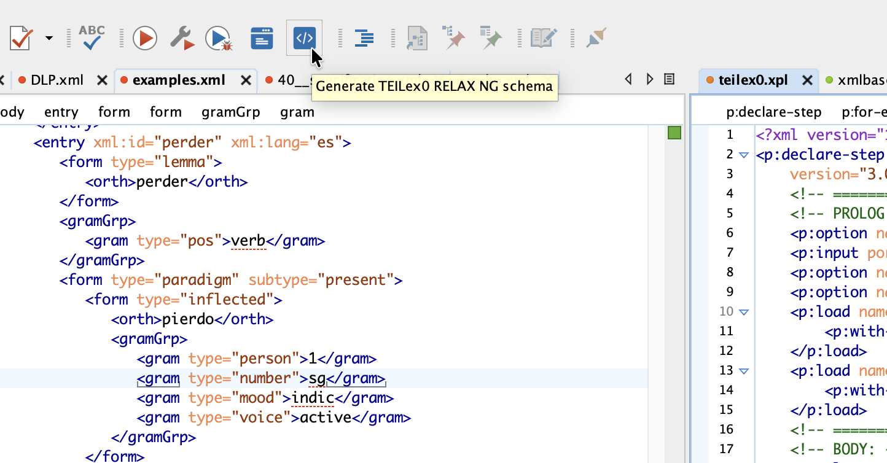

# OxyRuns

OxyRuns is a JavaScript plugin for oXygen XML Editor that adds project-specific buttons to the transformation toolbar. Each button runs a named transformation scenario.

This is particularly useful if you want easy access to self-contained transformation scenarios, i.e. scenarios that you'd like to be able to run regardless of the currently selected file in the editor.



## Install

1. Copy or symlink the `oxyruns` folder into your oXygen plugins directory. For instance:

   ```bash
   ln -s /Users/ttasovac/Development/BCDH/oxyruns/oxyruns \
     /Applications/Oxygen\ XML\ Editor/plugins/oxyruns
   ```

2. Restart Oxygen.

The plugin loads via `oxyruns/plugin.xml` and the toolbar buttons are populated from the local config file at `oxyruns/oxyruns.config.json`.

## Configure buttons

Create or edit `oxyruns/oxyruns.config.json` (this file is ignored by Git).  Each entry is an array of button definitions:

```json
{
  "projects": {
    "TEILex0": [
      {
        "label": "Build",
        "scenario": "TEILex0: Generate documentation",
        "tooltip": "Generate TEILex0 documentation",
        "icons": {
          "standard": "build.png",
          "retina": "build@2x.png"
        }
      },
      {
        "label": "Schema",
        "scenario": "TEILex0: ODD to RELAX NG XML",
        "tooltip": "Generate TEILex0 schema",
        "icons": {
          "standard": "schema.png",
          "retina": "schema@2x.png"
        }
      }
    ]
  }
}
```

Notes:

- Buttons will be shown only for projects listed in `projects`.
- `scenario` must match the exact transformation scenario name in oXygen.
- `tooltip` is optional. Omit it to show no tooltip.
- Icons are optional. If defined in the configuration file, they are loaded from `oxyruns/icons/`.
- Provide both a 24x24 and a 48x48 `@2x` variant of your png image to accommodate retina displays. For instance: `schema.png` and `schema@2x.png`.
- If no `icons` property is defined, a text-only button is created with the corresponding `label`: <br/>
  
  <br/>
- You can validate your configuration file in oXygen against the JSON Schema file `oxyruns/oxyruns.config.jschema`.

After editing the config, restart oXygen to reload buttons.

## Development reference (optional)

For development and further customization, you may want a local copy of the official oXygen `wsaccess` JavaScript sample plugins to use as reference material:

```bash
mkdir -p upstream
git clone https://github.com/oxygenxml/wsaccess-javascript-sample-plugins.git \
  upstream/oxygen-wsaccess-javascript-sample-plugins
```

To update your local reference copy:

```bash
cd upstream/oxygen-wsaccess-javascript-sample-plugins
git pull
```

This folder is intentionally ignored by Git (see `.gitignore`) and is not required to use this plugin.
