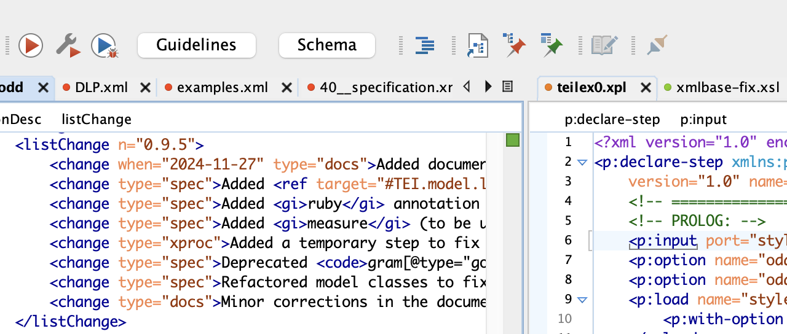

# OxyRuns

OxyRuns is a lightweight oXygen XML Editor plugin that adds a configurable toolbar for running predefined transformations with a single click.



## Install

1. Clone this repo somewhere on your system.
2. Copy or symlink the `oxyruns` folder into your oXygen plugins directory. On macOS this is typically: `/Applications/Oxygen XML Editor/plugins/`. For instance:

   ```bash
   ln -s /Users/ttasovac/Development/BCDH/oxyruns/oxyruns \
     /Applications/Oxygen\ XML\ Editor/plugins/oxyruns
   ```

3. Restart oXygen.

The plugin loads via `oxyruns/plugin.xml` and the toolbar buttons are populated from the local config file.

## Configure buttons

Create or edit `oxyruns/oxyruns.config.json` (this file is ignored by Git).

Buttons are shown only for projects listed in `projects`. Each entry is an array of button definitions:

```json
{
  "projects": {
    "TEILex0": [
      {
        "label": "Guidelines",
        "scenario": "TEILex0: Generate documentation",
        "tooltip": "Generate TEILex0 documentation"
      },
      {
        "label": "Schema",
        "scenario": "TEILex0: ODD to RELAX NG XML",
        "tooltip": "Generate TEILex0 schema"
      }
    ],
  }
}
```

You can validate your configuration file in oXygen against the JSON Schema file `oxyruns.config.jschema` in the OxyRuns plugin folder.

Notes:

- If a project is not listed, no buttons are shown.
- `scenario` must match the exact transformation scenario name in oXygen.
- `tooltip` is optional; omit it to show no tooltip.

After editing the config, restart oXygen to reload buttons.

## Development reference (optional)

For development and further customization, you may want a local copy of the official oXygen `wsaccess` JavaScript sample plugins to use as reference material:

```bash
mkdir -p upstream
git clone https://github.com/oxygenxml/wsaccess-javascript-sample-plugins.git \
  upstream/oxygen-wsaccess-javascript-sample-plugins
```

To update your local reference copy:

```bash
cd upstream/oxygen-wsaccess-javascript-sample-plugins
git pull
```

This folder is intentionally ignored by Git (see `.gitignore`) and is not required to use this plugin.
